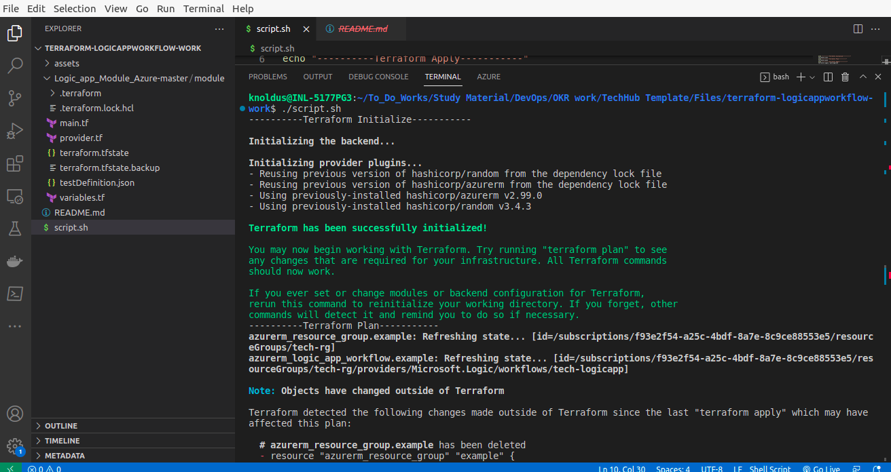
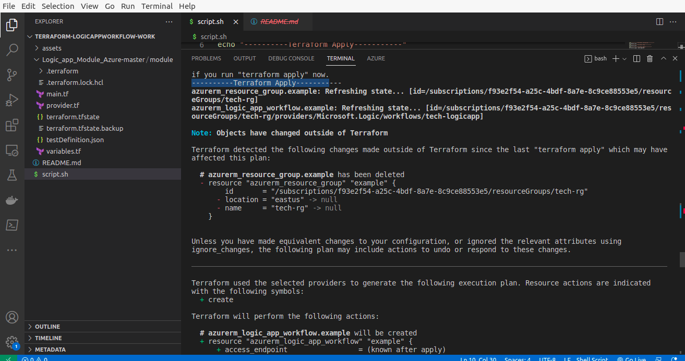
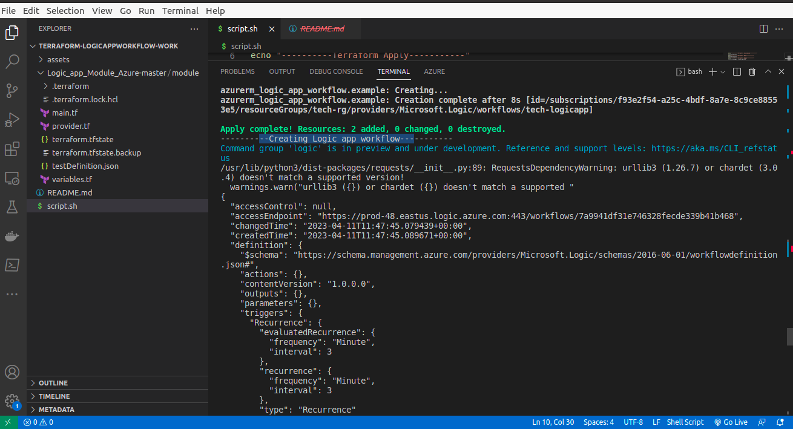
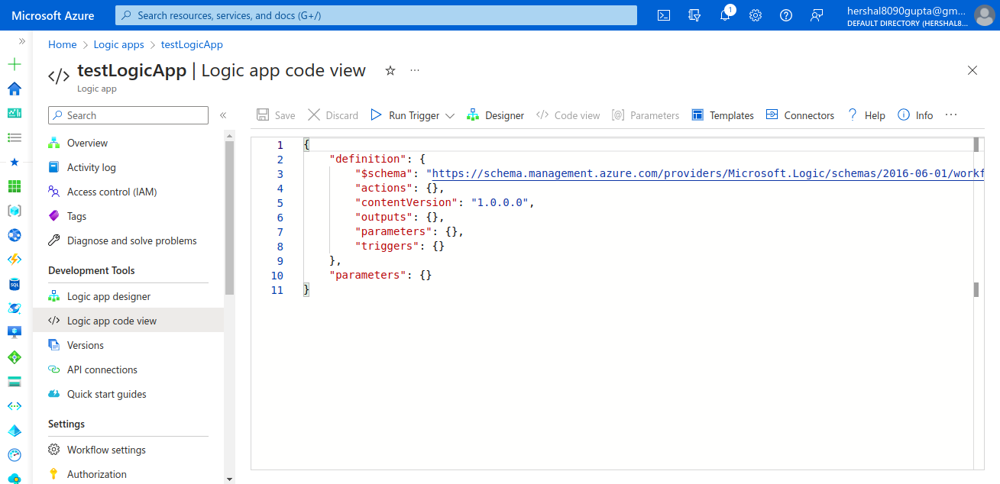
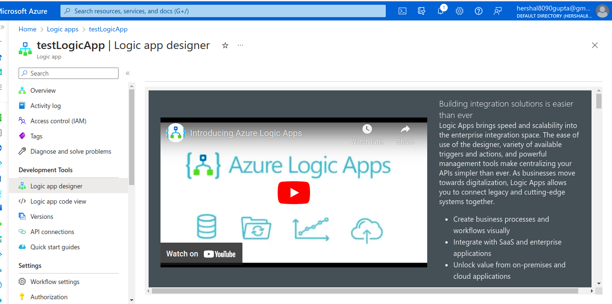
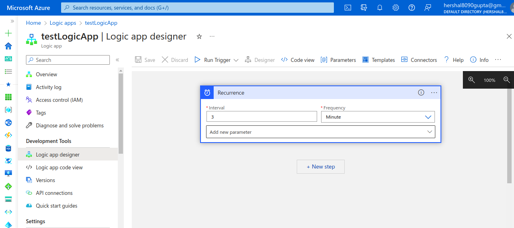
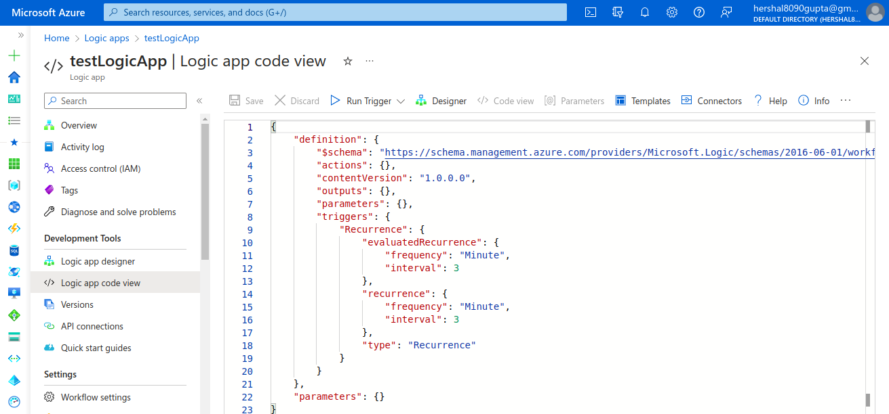

## Description

Here, In this template we will create the Logic App with the help of terraform and then create the Workflow inside the Logic App using the task definition from JSON file.

---

### Steps

* Login into AZ account using `az login` or `az login --tenant <TENANT-ID>`
* Change the permission of the file `chmod a+x script.sh`
* Go to the terminal and run the command `./script.sh` or run the script from any ID like Visual Code or IntelliJ.
* After running this script , it will create the module of logic app and add the logic app workflow in it using the JSON. 

---

### Outputs

1. Running the file and executing the steps :

2. Applying the terraform code in this step :

3. Creating the logic app workflow in this step using the `taskDefinition.json` file in `azure cli` : 

4. Before, applying the code Logic app code view :

5. Before, applying the code Logic app Designer view :

6. After, applying the code Logic app Designer view :

7. After, applying the code Logic app code view :

---